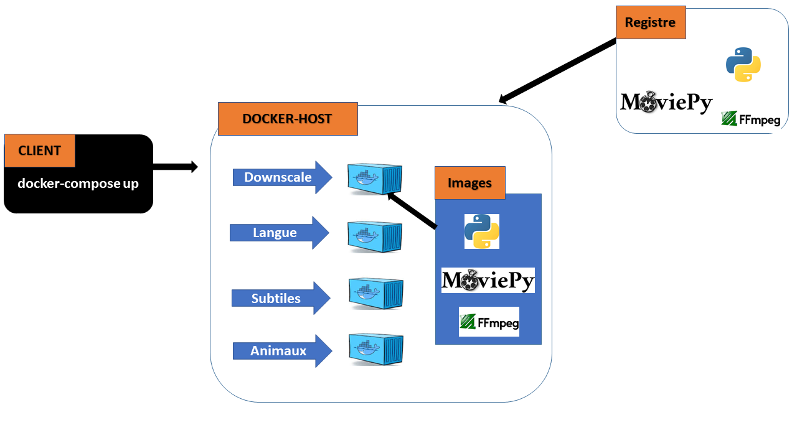

# 🎬 Video Processing Pipeline - DevOps Complet

Architecture DevOps complète avec **5 conteneurs Docker orchestrés** par Docker Compose et Kubernetes.

Pipeline modulaire pour traiter des vidéos :
- 🎥 **Downscale** (FFmpeg) - Compression vidéo
- 🐾 **Animal Detection** (YOLO11) - Détection d'animaux
- 🎙️ **Language Detection** (Speech Recognition) - Détection langue
- 📝 **Subtitles Generation** (Whisper) - Génération sous-titres VTT
- 🎬 **Video Merger** ⭐ NOUVEAU - Fusion vidéo + sous-titres

Chaque fonction est empaquetée comme un *worker* en conteneur. Un **Orchestrator Webhook** déclenche la pipeline complète automatiquement lors d'un upload vidéo.

---

## 📊 Architecture Générale

```
┌──────────────────────────────────────────────────────┐
│           Upload Interface (Frontend)                │
└────────────────────┬─────────────────────────────────┘
                     │
        ┌────────────▼──────────┐
        │  API Gateway (8000)   │
        │  FastAPI Upload       │
        └────────────┬──────────┘
                     │
    ┌────────────────▼────────────────┐
    │   ORCHESTRATOR WEBHOOK (8006)   │
    │  Gère pipeline automatique      │
    └────────────────┬────────────────┘
                     │
      ┌──────────────┴──────────────┐
      │      PIPELINE STAGES        │
      │
┌─────▼────────┐  ┌────────────────┬──────────────┐
│  DOWNSCALE   │  │ DETECTION      │              │
│  (8003)      │  │ (Parallèle)    │              │
│  FFmpeg      │  │ ├─ Animal      │  Language    │
│  Compress    │  │ │  YOLO11      │  Detection   │
└─────┬────────┘  │ │  (8001)      │  (8002)      │
      │           │ └─ Language    │              │
      │           │    Speech      │ Speech Rec   │
      │           │    Recognition │              │
      │           └────────────────┴──────────────┘
      │                      │
      │           ┌──────────▼──────────┐
      │           │  SUBTITLES (8004)  │
      │           │  Whisper + VTT     │
      │           └──────────┬──────────┘
      │                      │
      └──────────┬───────────┘
                 │
         ┌───────▼────────────────────┐
         │  VIDEO MERGER (8005) ⭐    │
         │  Fusion vidéo + sous-titres│
         │  Output: final_video.mp4   │
         └───────┬────────────────────┘
                 │
         ┌───────▼──────────────┐
         │ PERSISTENT STORAGE   │
         │ - Redis (Cache)      │
         │ - Shared Volumes     │
         └──────────────────────┘
```

---

## 🚀 DÉMARRAGE RAPIDE (30 Secondes)

### Option 1: Docker Compose (Local Development)

**Étape 1**: Aller au répertoire
```bash
cd cloud
```

**Étape 2**: Démarrer tous les services
```bash
bash docker-deploy.sh start
```

**Étape 3**: Accéder à l'application
```
http://localhost:8000
API Docs: http://localhost:8000/docs
```

✅ **Terminé!** Tous les services tournent localement

---

### Option 2: Kubernetes (Production)

**Windows PowerShell**:
```powershell
cd cloud
.\k8s-deploy.ps1 -Action deploy
```

**Linux/Mac**:
```bash
cd cloud
kubectl apply -f k8s/
```

---

## 📋 Pré-requis

### Pour Docker Compose (Local)
- ✅ Docker 20.10+
- ✅ Docker Compose 2.0+
- ✅ 8GB RAM minimum
- ✅ 20GB disque libre

### Pour Kubernetes (Production)
- ✅ Kubernetes 1.24+
- ✅ kubectl configuré
- ✅ StorageClass disponible
- ✅ Ingress controller (nginx)

---

## 🎯 ÉTAPES DE FONCTIONNEMENT DÉTAILLÉES

### Phase 1: Upload Vidéo

**Endpoint**: `POST /video/upload`

**Commande**:
```bash
curl -X POST http://localhost:8000/video/upload \
  -F "file=@ma_video.mp4"
```

**Réponse**:
```json
{
  "status": "ok",
  "file_id": "video_xxxxx_mp4",
  "filename": "ma_video.mp4",
  "size_mb": 125.5,
  "message": "Upload successful"
}
```

**Ce qui se passe**:
1. ✅ Fichier sauvegardé en stockage persistant
2. ✅ Validation fichier (taille, format)
3. ✅ Métadonnées stockées en Redis
4. ✅ Webhook orchestration déclenché

---

### Phase 2: Orchestration Automatique

**Déclenchement**: Automatique après upload

**Le Webhook Orchestrator (8006) déclenche la pipeline**:

```
POST /orchestrate
{
  "session_id": "uuid",
  "video_id": "video_xxxxx",
  "video_path": "/data/uploads/video.mp4"
}
```

**Réponse**:
```json
{
  "task_id": "abc12345",
  "status": "processing",
  "stages": {
    "downscale": {"status": "pending"},
    "animal_detection": {"status": "pending"},
    "language_detection": {"status": "pending"},
    "subtitles": {"status": "pending"},
    "merger": {"status": "pending"}
  }
}
```

---

### Phase 3: Downscale (FFmpeg)

**Service**: `downscale` (Port 8005)

**Endpoint**: `POST /downscale`

**Fonction**:
- Redimensionne la vidéo à max 1080p
- Réduit le bitrate pour performance
- Sortie: `video_downscaled.mp4`
- Temps: 5-10 secondes

**Logs**:
```bash
bash docker-deploy.sh logs downscale
```

**Résultat**:
```json
{
  "status": "success",
  "downscaled_path": "/data/outputs/video_downscaled.mp4",
  "original_size_mb": 125.5,
  "compressed_size_mb": 32.3
}
```

---

### Phase 4: Détection (Parallèle) ⚡

**Service A**: Animal Detector (Port 8001) - YOLO11
**Service B**: Language Detector (Port 8002) - Speech Recognition

**EXÉCUTION PARALLÈLE** (gagne du temps!):

**Animal Detection**:
```bash
bash docker-deploy.sh logs animal-detector
```

**Sortie**:
```json
{
  "status": "success",
  "animals_detected": ["chat", "chien", "oiseau"],
  "confidence_scores": [0.95, 0.88, 0.76],
  "frames_with_detection": 124
}
```

**Language Detection**:
```bash
bash docker-deploy.sh logs language-detector
```

**Sortie**:
```json
{
  "status": "success",
  "detected_language": "fr",
  "confidence": 0.98,
  "subtitle_format": "srt"
}
```

**Avantage**: Les deux s'exécutent en même temps! Temps total ≈ 30s

---

### Phase 5: Génération Sous-Titres

**Service**: `subtitles` (Port 8004) - Whisper

**Endpoint**: `POST /subtitles/generate`

**Fonction**:
- Extrait l'audio de la vidéo downscalée
- Utilise Whisper AI pour transcription
- Génère fichier VTT
- Sortie: `video.vtt`
- Temps: 20-60 secondes

**Logs**:
```bash
bash docker-deploy.sh logs subtitles
```

**Résultat**:
```json
{
  "status": "success",
  "vtt_path": "/data/outputs/video.vtt",
  "transcription_complete": true,
  "subtitle_count": 256,
  "duration_seconds": 300
}
```

**Fichier VTT généré**:
```vtt
WEBVTT

00:00:00.000 --> 00:00:05.000
Bonjour, ceci est un test vidéo

00:00:05.000 --> 00:00:10.000
Avec détection automatique de la parole
```

---

### Phase 6: Fusion Vidéo + Sous-Titres ⭐ NOUVEAU

**Service**: `video-merger` (Port 8005) - FFmpeg Merger

**Endpoint**: `POST /video-merger/merge`

**Fonction**:
- Reçoit: Vidéo downscalée + fichier VTT
- Utilise FFmpeg pour fusionner
- Intègre sous-titres (hardsub/softsub)
- Sortie: `final_video.mp4`
- Temps: 10-20 secondes

**Logs**:
```bash
bash docker-deploy.sh logs video-merger
```

**Commande**:
```bash
curl -X POST http://localhost:8005/merge \
  -H "Content-Type: application/json" \
  -d '{
    "video_path": "/data/outputs/video_downscaled.mp4",
    "subtitles_path": "/data/outputs/video.vtt",
    "output_filename": "final_video.mp4"
  }'
```

**Résultat**:
```json
{
  "status": "success",
  "output_path": "/data/outputs/final_video.mp4",
  "file_size_mb": 35.2,
  "subtitle_type": "hardsub",
  "processing_time_sec": 15,
  "download_url": "/download/final_video.mp4"
}
```

**Fichier final généré**: `final_video.mp4` ✅ (Prêt à télécharger!)

---

### Phase 7: Récupérer le Résultat

**Endpoint**: `GET /status/{file_id}`

**Commande**:
```bash
curl http://localhost:8000/video/status/video_xxxxx_mp4
```

**Réponse Finale**:
```json
{
  "status": "completed",
  "file_id": "video_xxxxx_mp4",
  "processing_time_minutes": 2.5,
  "result": {
    "final_video": "/data/outputs/final_video.mp4",
    "animals_detected": ["chat", "chien"],
    "language": "fr",
    "subtitles": "/data/outputs/video.vtt",
    "download_url": "/video/download/final_video.mp4"
  }
}
```

**Télécharger**:
```bash
curl -O http://localhost:8000/video/download/final_video.mp4
```

✅ **Vidéo finale avec sous-titres intégrés!**

---

## 📝 EXEMPLE COMPLET: Étape par Étape

### Étape 1: Lancer les services
```bash
cd cloud
bash docker-deploy.sh start
```

### Étape 2: Créer un fichier vidéo de test
```bash
# Avec ffmpeg:
ffmpeg -f lavfi -i testsrc=s=640x480:d=30 \
  -f lavfi -i sine=f=440:d=30 \
  -pix_fmt yuv420p test_video.mp4
```

### Étape 3: Upload
```bash
curl -X POST http://localhost:8000/video/upload \
  -F "file=@test_video.mp4"
```

### Étape 4: Vérifier le statut
```bash
# Au démarrage (peu de temps après upload)
curl http://localhost:8000/video/status/video_xxxxx_mp4

# Résultat: "status": "processing"
```

### Étape 5: Attendre la completion
```bash
# Regarder les logs en temps réel
bash docker-deploy.sh logs orchestrator
bash docker-deploy.sh logs video-merger

# Ou vérifier le statut chaque 30 secondes
watch -n 30 'curl -s http://localhost:8000/video/status/video_xxxxx_mp4 | jq'
```

### Étape 6: Récupérer le résultat
```bash
# Quand status = "completed"
curl -O http://localhost:8000/video/download/final_video.mp4

# Lire le fichier final avec VLC
vlc final_video.mp4
```

---

## 🔄 TIMELINE DE TRAITEMENT

| Étape | Durée | Service | Parallèle? |
|-------|-------|---------|-----------|
| Downscale | 5-10s | FFmpeg | Non |
| Animal Detect | 15-30s | YOLO11 | ✅ OUI |
| Language Detect | 10-20s | Speech | ✅ OUI |
| Subtitles | 20-60s | Whisper | Non |
| Video Merger | 10-20s | FFmpeg | Non |
| **TOTAL** | **60-140s** | - | - |

**Temps réel**: ≈ 1-2 minutes par vidéo

---

## 🐳 COMMANDES DOCKER COURANTES

```bash
# Démarrer
bash docker-deploy.sh start

# Arrêter
bash docker-deploy.sh stop

# Redémarrer
bash docker-deploy.sh restart

# Voir logs d'un service
bash docker-deploy.sh logs api
bash docker-deploy.sh logs video-merger
bash docker-deploy.sh logs orchestrator

# Vérifier la santé
bash docker-deploy.sh health

# Tester upload
bash docker-deploy.sh test

# Voir statut conteneurs
bash docker-deploy.sh status

# Nettoyer tout
bash docker-deploy.sh clean
```

---

## ☸️ COMMANDES KUBERNETES

```bash
# Déployer
./k8s-deploy.ps1 -Action deploy

# Voir statut
./k8s-deploy.ps1 -Action status

# Logs service
./k8s-deploy.ps1 -Action logs -Service video-merger

# Redémarrer
./k8s-deploy.ps1 -Action restart -Service api-gateway

# Scaler
./k8s-deploy.ps1 -Action scale -Service video-merger -Replicas 5
```

---

## 📊 ACCÈS AUX SERVICES

### Local (Docker Compose)
| Service | URL | Port |
|---------|-----|------|
| API | http://localhost:8000 | 8000 |
| Docs | http://localhost:8000/docs | 8000 |
| Animal Detector | http://localhost:8001 | 8001 |
| Language Detector | http://localhost:8002 | 8002 |
| Downscale | http://localhost:8003 | 8003 |
| Subtitles | http://localhost:8004 | 8004 |
| Video Merger | http://localhost:8005 | 8005 |
| Redis | localhost:6379 | 6379 |

### Production (Kubernetes)
```
Ingress: https://video.yourdomain.com
Port forward: kubectl port-forward svc/api-gateway 8000:8000
```

---

## 🔍 MONITORING & DEBUGGING

### Voir les logs en temps réel
```bash
# API Gateway
bash docker-deploy.sh logs api -f

# Video Merger (le nouveau service)
bash docker-deploy.sh logs video-merger -f

# Tous les logs
docker-compose logs -f
```

### Vérifier la santé des services
```bash
bash docker-deploy.sh health

# Résultat:
# ✅ API Gateway (Port 8000)
# ✅ Animal Detector (Port 8001)
# ✅ Language Detector (Port 8002)
# ✅ Downscale (Port 8003)
# ✅ Subtitles (Port 8004)
# ✅ Video Merger (Port 8005)
# ✅ Redis (Port 6379)
```

### Tester un upload
```bash
bash docker-deploy.sh test
```

---

## 📁 STRUCTURE DES FICHIERS

```
cloud/
├── 🐳 Dockerfiles
│   ├── Dockerfile.api
│   ├── Dockerfile.animal-detector
│   ├── Dockerfile.language-detector
│   ├── Dockerfile.downscale
│   ├── Dockerfile.subtitles
│   └── Dockerfile.video-merger ⭐ NOUVEAU
│
├── 🐋 Docker Compose
│   ├── docker-compose.yml
│   ├── nginx/nginx.conf
│   └── docker-deploy.sh
│
├── ☸️ Kubernetes
│   ├── k8s/01-namespace-configmap-pvc.yaml
│   ├── k8s/02-services-deployments.yaml
│   ├── k8s/03-api-gateway-ingress-hpa.yaml
│   ├── k8s/04-orchestrator-webhook.yaml
│   └── k8s-deploy.ps1
│
├── 📝 Backend Services
│   └── backend/services/video_merger/
│       ├── merger.py
│       ├── api.py
│       └── requirements.txt
│
└── 📚 Documentation
    ├── START_HERE.md
    ├── QUICKSTART.md
    ├── README_DEVOPS.md
    ├── DEVOPS_ARCHITECTURE.md
    ├── DEPLOYMENT_GUIDE.md
    ├── TESTING_GUIDE.md
    ├── EXECUTIVE_SUMMARY.md
    └── ... (8 guides totaux)
```

---

## 🆘 TROUBLESHOOTING

### Problème: Services ne démarrent pas
```bash
# Vérifier les logs
bash docker-deploy.sh logs api

# Nettoyer et recommencer
bash docker-deploy.sh clean
bash docker-deploy.sh start
```

### Problème: Timeout upload
```bash
# Augmenter le timeout dans docker-compose.yml
# ou vérifier l'espace disque
df -h
```

### Problème: Video Merger ne fusionne pas
```bash
# Vérifier les logs
bash docker-deploy.sh logs video-merger

# Vérifier les fichiers d'entrée
docker exec video-merger ls -lah /app/data/
```

→ **Guide complet**: Lire [`DEPLOYMENT_GUIDE.md`](DEPLOYMENT_GUIDE.md)

---

## 📖 DOCUMENTATION COMPLÈTE

- **[START_HERE.md](START_HERE.md)** - Point d'entrée
- **[QUICKSTART.md](QUICKSTART.md)** - Démarrage rapide
- **[README_DEVOPS.md](README_DEVOPS.md)** - Vue d'ensemble
- **[DEVOPS_ARCHITECTURE.md](DEVOPS_ARCHITECTURE.md)** - Architecture détaillée
- **[DEPLOYMENT_GUIDE.md](DEPLOYMENT_GUIDE.md)** - Déploiement complet
- **[TESTING_GUIDE.md](TESTING_GUIDE.md)** - Validation & tests
- **[EXECUTIVE_SUMMARY.md](EXECUTIVE_SUMMARY.md)** - Résumé business

---

## ✨ PROCHAINES ÉTAPES

1. **Maintenant**: Lire ce README
2. **Prochaine**: `bash docker-deploy.sh start`
3. **Ensuite**: `curl -F "file=@video.mp4" http://localhost:8000/video/upload`
4. **Final**: Accéder à http://localhost:8000/docs pour l'API interactive

---

**Status**: ✅ Production Ready  
**Version**: 1.0.0  
**Date**: Janvier 2026

**mail**: [landrynoumbissi23@gmail.com?subject=je vous contacte depuis le GitHub du Projet vidéo DevOps&body=Bonjour Monsieur Landry Noumbissi](mailto:landrynoumbissi23@gmail.com)

**Prêt à traiter vos vidéos! 🚀**

## Architecture & choix techniques


- `Isolation des tâches`: chaque worker est un service indépendant exposant une endpoint REST simple `/process`. Cela permet scalabilité horizontale (kubernetes / ecs).

- `Stockage intermédiaire`: volume partagé `./data` monté sur tous les services  simple et efficace en local / VM.

- `Transcription`: Whisper  pour robustesse multi-langue. Sur GPU, utiliser `large/medium` pour meilleure qualité.

- `Detection d’objets`: Ultralytics YOLOv8 (poids `yolov8n` pour démarrer), filtrage sur labels animal courants.


- `S3 + DynamoDB`: stockage durable des assets + métadonnées (recherche, indexation).

- 


